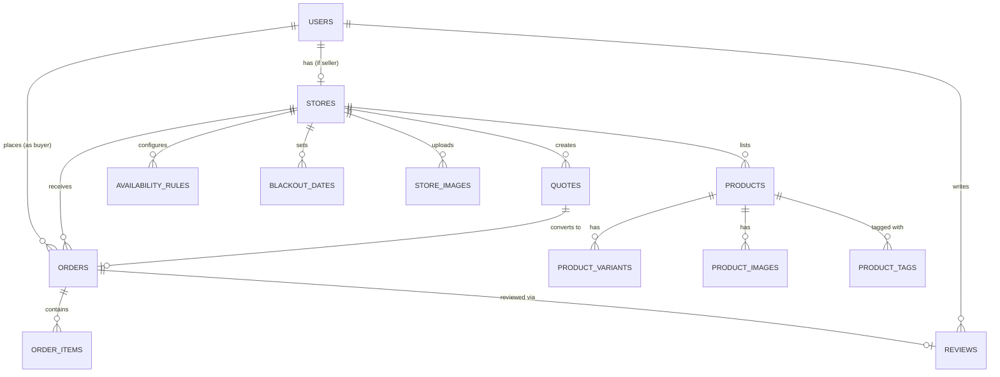
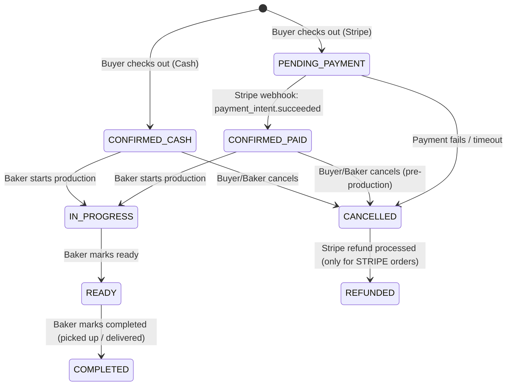
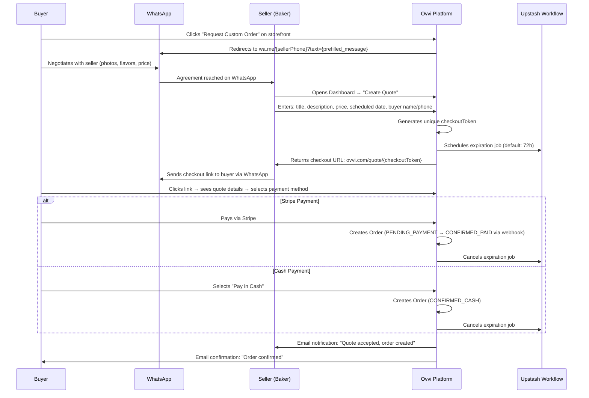
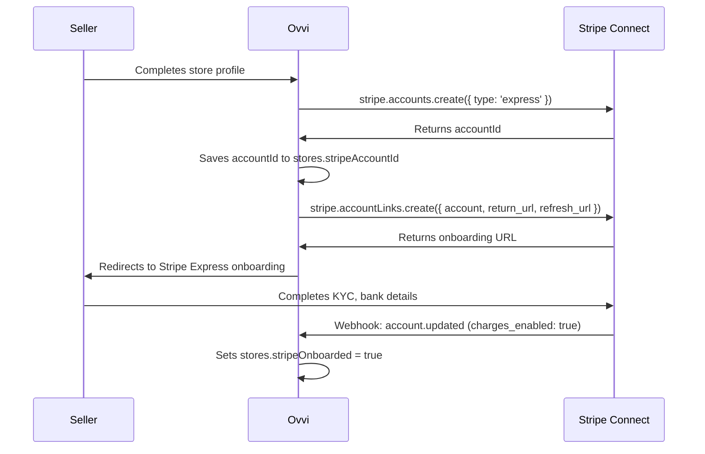
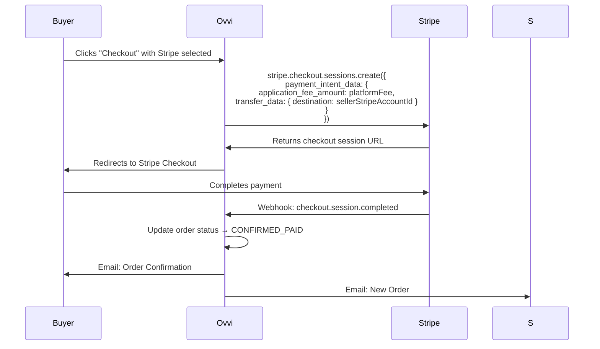

# Ovvi — Implementation Plan

> [!NOTE]
> This plan incorporates all 4 executive updates from the user: WhatsApp Quote Link flow, liability/quality control stance, Drizzle + Supabase stack adoption, and cash/pickup fulfillment support. Architectural defaults from [pending_resolutions.md](file:///C:/Users/DELL/.gemini/antigravity/brain/258a5a86-74e6-46c3-9342-8d62766ab0c9/pending_resolutions.md) are used for all unresolved decisions.

---

## Revised Tech Stack

| Layer | Technology | Package |
| :--- | :--- | :--- |
| **Framework** | Next.js (App Router) | `next` |
| **Language** | TypeScript | `typescript` |
| **Styling** | Tailwind CSS v4 + Shadcn UI | `tailwindcss`, `@shadcn/ui` |
| **Database** | PostgreSQL + PostGIS (Supabase) | Supabase hosted instance |
| **ORM** | Drizzle ORM | `drizzle-orm`, `drizzle-kit` |
| **DB Driver** | postgres.js | `postgres` |
| **Auth** | Clerk | `@clerk/nextjs` |
| **Payments** | Stripe Connect (Express) | `stripe` |
| **Media** | Cloudinary | `cloudinary`, `next-cloudinary` |
| **Email** | Resend + React Email | `resend`, `@react-email/components` |
| **Background Jobs** | Upstash Workflow | `@upstash/workflow` |
| **Rate Limiting** | Upstash Redis | `@upstash/ratelimit`, `@upstash/redis` |
| **Hosting** | Vercel + Supabase | — |

---

## Project Structure

```
ovvi/
├── src/
│   ├── app/                          # Next.js App Router
│   │   ├── (auth)/                   # Auth layout group (sign-in, sign-up)
│   │   │   ├── sign-in/[[...sign-in]]/page.tsx
│   │   │   └── sign-up/[[...sign-up]]/page.tsx
│   │   ├── (marketing)/              # Public marketing pages
│   │   │   ├── layout.tsx
│   │   │   └── page.tsx              # Landing page
│   │   ├── (marketplace)/            # Buyer-facing marketplace
│   │   │   ├── layout.tsx
│   │   │   ├── page.tsx              # Marketplace discovery/search
│   │   │   ├── bakery/
│   │   │   │   └── [slug]/           # Baker storefront
│   │   │   │       ├── page.tsx      # Storefront page
│   │   │   │       └── product/
│   │   │   │           └── [productId]/page.tsx
│   │   │   ├── cart/page.tsx
│   │   │   ├── checkout/page.tsx     # Standard order checkout
│   │   │   └── quote/
│   │   │       └── [quoteId]/page.tsx  # Custom quote checkout link
│   │   ├── (dashboard)/              # Authenticated dashboard layout
│   │   │   ├── layout.tsx            # Sidebar + role guard
│   │   │   ├── seller/               # Seller OS
│   │   │   │   ├── page.tsx          # Seller dashboard home
│   │   │   │   ├── onboarding/page.tsx
│   │   │   │   ├── menu/page.tsx     # Menu builder
│   │   │   │   ├── orders/page.tsx   # Order management
│   │   │   │   ├── quotes/           # Custom quote management
│   │   │   │   │   ├── page.tsx      # Quote list
│   │   │   │   │   └── new/page.tsx  # Create new quote
│   │   │   │   ├── availability/page.tsx
│   │   │   │   ├── storefront/page.tsx  # Storefront settings + shareable link
│   │   │   │   └── financials/page.tsx
│   │   │   ├── buyer/                # Buyer account
│   │   │   │   ├── orders/page.tsx   # Order history
│   │   │   │   └── settings/page.tsx
│   │   │   └── admin/                # Platform admin
│   │   │       ├── sellers/page.tsx
│   │   │       ├── orders/page.tsx
│   │   │       └── financials/page.tsx
│   │   └── api/                      # API Route Handlers
│   │       ├── webhooks/
│   │       │   ├── stripe/route.ts
│   │       │   └── clerk/route.ts
│   │       ├── uploadthing/route.ts  # (or Cloudinary upload endpoint)
│   │       └── workflow/             # Upstash Workflow endpoints
│   │           ├── expire-quote/route.ts
│   │           └── order-reminders/route.ts
│   ├── components/
│   │   ├── ui/                       # Shadcn UI primitives
│   │   ├── marketplace/              # Buyer-facing components
│   │   ├── dashboard/                # Seller dashboard components
│   │   └── shared/                   # Shared components
│   ├── db/
│   │   ├── index.ts                  # Drizzle client init
│   │   ├── schema/                   # Drizzle schema definitions
│   │   │   ├── users.ts
│   │   │   ├── stores.ts
│   │   │   ├── products.ts
│   │   │   ├── orders.ts
│   │   │   ├── quotes.ts
│   │   │   ├── reviews.ts
│   │   │   ├── availability.ts
│   │   │   └── enums.ts
│   │   └── migrations/               # Drizzle-kit generated migrations
│   ├── lib/
│   │   ├── stripe.ts                 # Stripe client + helpers
│   │   ├── cloudinary.ts             # Cloudinary config
│   │   ├── resend.ts                 # Email client
│   │   ├── upstash.ts                # Upstash Workflow client
│   │   ├── validators/               # Zod schemas for form/API validation
│   │   └── utils.ts                  # General utilities
│   ├── actions/                      # Server Actions (mutations)
│   │   ├── store.actions.ts
│   │   ├── product.actions.ts
│   │   ├── order.actions.ts
│   │   ├── quote.actions.ts
│   │   ├── review.actions.ts
│   │   └── availability.actions.ts
│   ├── queries/                      # Data fetching functions (reads)
│   │   ├── store.queries.ts
│   │   ├── product.queries.ts
│   │   ├── order.queries.ts
│   │   └── marketplace.queries.ts
│   ├── hooks/                        # Client-side React hooks
│   ├── types/                        # Shared TypeScript types
│   └── emails/                       # React Email templates
│       ├── order-confirmation.tsx
│       ├── quote-ready.tsx
│       └── order-status-update.tsx
├── public/
├── drizzle.config.ts
├── next.config.ts
├── middleware.ts                      # Clerk auth + role-based routing
├── .env.local
├── package.json
└── tsconfig.json
```

> [!TIP]
> **Key architectural pattern:** Server Actions (`src/actions/`) handle all mutations (create, update, delete). Query functions (`src/queries/`) handle all reads. This separates concerns cleanly and makes Server Components data-fetching explicit.

---

## Database Schema Design

### Enums

```typescript
// src/db/schema/enums.ts

export const userRoleEnum = pgEnum('user_role', ['BUYER', 'SELLER', 'ADMIN']);

export const storeStatusEnum = pgEnum('store_status', [
  'ONBOARDING',     // Profile incomplete
  'PENDING_REVIEW', // Submitted for admin approval
  'ACTIVE',         // Live on marketplace
  'SUSPENDED',      // Admin-suspended
  'DEACTIVATED',    // Self-deactivated by seller
]);

export const orderStatusEnum = pgEnum('order_status', [
  'PENDING_PAYMENT',   // Stripe checkout session created, awaiting payment
  'CONFIRMED_PAID',    // Stripe payment succeeded
  'CONFIRMED_CASH',    // Cash order — no payment, directly confirmed
  'IN_PROGRESS',       // Baker has started production
  'READY',             // Ready for pickup/delivery
  'COMPLETED',         // Picked up / delivered
  'CANCELLED',         // Cancelled by buyer or seller
  'REFUNDED',          // Stripe refund processed
]);

export const paymentMethodEnum = pgEnum('payment_method', ['STRIPE', 'CASH']);

export const fulfillmentTypeEnum = pgEnum('fulfillment_type', ['PICKUP', 'DELIVERY']);

export const quoteStatusEnum = pgEnum('quote_status', [
  'DRAFT',         // Baker is creating the quote
  'SENT',          // Checkout link generated and (presumably) shared via WhatsApp
  'ACCEPTED',      // Buyer has paid via the checkout link
  'EXPIRED',       // Quote link expired (Upstash timer fired)
  'CANCELLED',     // Baker cancelled the quote
]);

export const productTypeEnum = pgEnum('product_type', ['STANDARD', 'CUSTOM']);
```

### Tables



### Table Definitions

#### `users`
| Column | Type | Notes |
|---|---|---|
| `id` | `uuid` PK | Generated, also maps to Clerk user ID |
| `clerkId` | `text` UNIQUE NOT NULL | Clerk external ID |
| `email` | `text` NOT NULL | |
| `firstName` | `text` | |
| `lastName` | `text` | |
| `phone` | `text` | |
| `role` | `user_role` NOT NULL | Default: `'BUYER'` |
| `avatarUrl` | `text` | |
| `createdAt` | `timestamp` | Default: `now()` |
| `updatedAt` | `timestamp` | Auto-updated |

#### `stores`
| Column | Type | Notes |
|---|---|---|
| `id` | `uuid` PK | |
| `userId` | `uuid` FK → users | UNIQUE (one store per seller) |
| `name` | `text` NOT NULL | Bakery name |
| `slug` | `text` UNIQUE NOT NULL | URL-friendly identifier for SEO storefront |
| `description` | `text` | |
| `logoUrl` | `text` | |
| `bannerUrl` | `text` | |
| `status` | `store_status` | Default: `'ONBOARDING'` |
| `currency` | `text` | Default: `'USD'` — ISO 4217 code |
| `location` | `geometry(Point, 4326)` | PostGIS point (lng, lat) |
| `address` | `text` | Human-readable address |
| `city` | `text` | For filtering |
| `country` | `text` | |
| `pickupEnabled` | `boolean` | Default: `true` |
| `pickupInstructions` | `text` | |
| `deliveryEnabled` | `boolean` | Default: `false` |
| `deliveryFee` | `integer` | In smallest currency unit (cents) |
| `deliveryRadius` | `integer` | In meters — for future zone-based logic |
| `cashEnabled` | `boolean` | Default: `true` — global toggle |
| `whatsappNumber` | `text` | For wa.me link generation |
| `instagramHandle` | `text` | |
| `stripeAccountId` | `text` | Stripe Connect account ID |
| `stripeOnboarded` | `boolean` | Default: `false` |
| `leadTimeDays` | `integer` | Default minimum lead time for orders |
| `maxOrdersPerDay` | `integer` | Capacity limit |
| `createdAt` | `timestamp` | |
| `updatedAt` | `timestamp` | |

#### `products`
| Column | Type | Notes |
|---|---|---|
| `id` | `uuid` PK | |
| `storeId` | `uuid` FK → stores | |
| `name` | `text` NOT NULL | |
| `description` | `text` | |
| `type` | `product_type` | `'STANDARD'` or `'CUSTOM'` |
| `basePrice` | `integer` | In cents. NULL for custom-only products |
| `isActive` | `boolean` | Default: `true` |
| `cashEnabled` | `boolean` | Default: `true` — per-product override |
| `sortOrder` | `integer` | For manual menu ordering |
| `createdAt` | `timestamp` | |
| `updatedAt` | `timestamp` | |

#### `product_variants`
| Column | Type | Notes |
|---|---|---|
| `id` | `uuid` PK | |
| `productId` | `uuid` FK → products | |
| `name` | `text` NOT NULL | e.g., "6-inch", "8-inch", "12 cupcakes" |
| `priceModifier` | `integer` | Additional cents on top of base price |
| `isActive` | `boolean` | Default: `true` |
| `sortOrder` | `integer` | |

#### `product_images`
| Column | Type | Notes |
|---|---|---|
| `id` | `uuid` PK | |
| `productId` | `uuid` FK → products | |
| `url` | `text` NOT NULL | Cloudinary URL |
| `publicId` | `text` NOT NULL | Cloudinary public ID (for deletion) |
| `altText` | `text` | |
| `sortOrder` | `integer` | Primary image = sortOrder 0 |

#### `product_tags`
| Column | Type | Notes |
|---|---|---|
| `id` | `uuid` PK | |
| `productId` | `uuid` FK → products | |
| `tag` | `text` NOT NULL | e.g., `'vegan'`, `'gluten-free'`, `'nut-free'`, `'birthday'`, `'wedding'` |

> Composite unique index on `(productId, tag)`.

#### `store_images` (Gallery / Portfolio)
| Column | Type | Notes |
|---|---|---|
| `id` | `uuid` PK | |
| `storeId` | `uuid` FK → stores | |
| `url` | `text` NOT NULL | |
| `publicId` | `text` NOT NULL | |
| `caption` | `text` | |
| `sortOrder` | `integer` | |

#### `availability_rules`
| Column | Type | Notes |
|---|---|---|
| `id` | `uuid` PK | |
| `storeId` | `uuid` FK → stores | |
| `dayOfWeek` | `integer` | 0 (Sun) – 6 (Sat) |
| `isAvailable` | `boolean` | Default: `true` |
| `maxOrders` | `integer` | Per-day capacity cap |

#### `blackout_dates`
| Column | Type | Notes |
|---|---|---|
| `id` | `uuid` PK | |
| `storeId` | `uuid` FK → stores | |
| `date` | `date` NOT NULL | |
| `reason` | `text` | Optional: "Holiday", "Vacation", etc. |

#### `orders`
| Column | Type | Notes |
|---|---|---|
| `id` | `uuid` PK | |
| `orderNumber` | `text` UNIQUE | Human-readable (e.g., `OVV-20260628-A3X`) |
| `storeId` | `uuid` FK → stores | |
| `buyerId` | `uuid` FK → users | |
| `quoteId` | `uuid` FK → quotes | NULL for standard orders |
| `status` | `order_status` | |
| `paymentMethod` | `payment_method` | `'STRIPE'` or `'CASH'` |
| `fulfillmentType` | `fulfillment_type` | `'PICKUP'` or `'DELIVERY'` |
| `deliveryAddress` | `text` | NULL if pickup |
| `deliveryFee` | `integer` | In cents. 0 if pickup |
| `subtotal` | `integer` | In cents (sum of line items) |
| `platformFee` | `integer` | In cents (calculated at checkout) |
| `total` | `integer` | In cents (subtotal + deliveryFee) |
| `depositAmount` | `integer` | In cents — for future deposit logic |
| `currency` | `text` | Inherited from store |
| `stripePaymentIntentId` | `text` | NULL for cash orders |
| `stripeTransferId` | `text` | NULL for cash orders |
| `scheduledDate` | `date` NOT NULL | The date the order is due (pickup/delivery) |
| `scheduledTimeSlot` | `text` | e.g., "10:00-12:00" |
| `buyerNotes` | `text` | Special instructions |
| `cancelledAt` | `timestamp` | |
| `cancelReason` | `text` | |
| `completedAt` | `timestamp` | |
| `createdAt` | `timestamp` | |
| `updatedAt` | `timestamp` | |

#### `order_items`
| Column | Type | Notes |
|---|---|---|
| `id` | `uuid` PK | |
| `orderId` | `uuid` FK → orders | |
| `productId` | `uuid` FK → products | |
| `variantId` | `uuid` FK → product_variants | NULL if no variant |
| `productName` | `text` NOT NULL | Snapshot at time of order |
| `variantName` | `text` | Snapshot |
| `unitPrice` | `integer` | Snapshot in cents |
| `quantity` | `integer` | Default: 1 |
| `totalPrice` | `integer` | `unitPrice * quantity` |

> [!IMPORTANT]
> **Price snapshots:** `productName`, `variantName`, and `unitPrice` are copied into the order item at order creation time. This ensures historical orders are not affected by future price/name changes.

#### `quotes` (Custom Quote / WhatsApp Flow)
| Column | Type | Notes |
|---|---|---|
| `id` | `uuid` PK | |
| `storeId` | `uuid` FK → stores | |
| `buyerId` | `uuid` FK → users | NULL until buyer clicks checkout link and authenticates |
| `title` | `text` NOT NULL | e.g., "3-Tier Wedding Cake – Blue Roses" |
| `description` | `text` | Baker's description of the custom order |
| `price` | `integer` NOT NULL | In cents |
| `currency` | `text` | Inherited from store |
| `status` | `quote_status` | Default: `'DRAFT'` |
| `checkoutToken` | `text` UNIQUE | Secure random token for the checkout URL |
| `scheduledDate` | `date` | When the order is due |
| `expiresAt` | `timestamp` | When the checkout link expires |
| `buyerName` | `text` | Baker can pre-fill buyer's name from WhatsApp |
| `buyerPhone` | `text` | Baker can pre-fill buyer's phone from WhatsApp |
| `acceptedAt` | `timestamp` | When buyer paid |
| `orderId` | `uuid` FK → orders | Created when buyer pays — links quote to order |
| `createdAt` | `timestamp` | |
| `updatedAt` | `timestamp` | |

#### `reviews`
| Column | Type | Notes |
|---|---|---|
| `id` | `uuid` PK | |
| `orderId` | `uuid` FK → orders | UNIQUE — one review per order |
| `storeId` | `uuid` FK → stores | Denormalized for query efficiency |
| `buyerId` | `uuid` FK → users | |
| `rating` | `integer` NOT NULL | 1–5 |
| `comment` | `text` | |
| `createdAt` | `timestamp` | |

#### `reports` (Vendor Reports)
| Column | Type | Notes |
|---|---|---|
| `id` | `uuid` PK | |
| `storeId` | `uuid` FK → stores | The reported store |
| `reporterId` | `uuid` FK → users | The buyer who filed the report |
| `reason` | `text` NOT NULL | |
| `details` | `text` | |
| `status` | `text` | Default: `'OPEN'` — `'OPEN'`, `'REVIEWED'`, `'RESOLVED'` |
| `createdAt` | `timestamp` | |

### Critical Indexes

```sql
-- Geo-spatial search (marketplace discovery)
CREATE INDEX idx_stores_location ON stores USING GIST (location);

-- Marketplace filtering
CREATE INDEX idx_stores_city_status ON stores (city, status);
CREATE INDEX idx_products_store_active ON products (store_id, is_active);
CREATE INDEX idx_product_tags_tag ON product_tags (tag);

-- Order queries (seller dashboard)
CREATE INDEX idx_orders_store_status ON orders (store_id, status);
CREATE INDEX idx_orders_buyer ON orders (buyer_id);
CREATE INDEX idx_orders_scheduled_date ON orders (store_id, scheduled_date);

-- Availability checks
CREATE INDEX idx_blackout_dates_store_date ON blackout_dates (store_id, date);
CREATE INDEX idx_availability_rules_store ON availability_rules (store_id, day_of_week);

-- Quote lookup by token (checkout link)
CREATE INDEX idx_quotes_checkout_token ON quotes (checkout_token);

-- Reviews aggregation
CREATE INDEX idx_reviews_store ON reviews (store_id);
```

---

## Order State Machine

Two distinct paths based on payment method:



### Key Rules

| Rule | Detail |
|---|---|
| **Cash bypass** | `CASH` orders skip `PENDING_PAYMENT` entirely → go straight to `CONFIRMED_CASH`. No Stripe payment intent is created. |
| **Calendar blocking** | Both `CONFIRMED_PAID` and `CONFIRMED_CASH` count against the baker's `maxOrdersPerDay` for the `scheduledDate`. |
| **Cancellation** | Only allowed while status is `CONFIRMED_*` (pre-production). Once `IN_PROGRESS`, cancellation is disabled. |
| **Refunds** | Only applicable to `STRIPE` orders. Cash orders have no refund mechanism via the platform. |
| **Quote → Order** | When a buyer pays a custom quote, a new `order` record is created with `quoteId` set, and the quote status moves to `ACCEPTED`. |

---

## Custom Quote Flow (WhatsApp Integration)



### Pre-filled WhatsApp Message Template

```
Hi! 👋 I'm interested in a custom order from {storeName} on Ovvi.

Here's what I'm looking for:
- Occasion:
- Date needed:
- Servings/Size:
- Flavor preferences:
- Any dietary requirements:

Looking forward to hearing from you! 🎂
```

This is generated as a URL:
```
https://wa.me/{sellerWhatsappNumber}?text={encodeURIComponent(prefilledMessage)}
```

---

## Shareable Storefront & Bio-Link (Cold Start Solution)

Each store gets a **public, SEO-optimized storefront page** at:
```
ovvi.com/bakery/{slug}
```

This page serves as both:
1. **A marketplace listing** (discoverable via search).
2. **A standalone link-in-bio page** that bakers can drop into their Instagram bio, WhatsApp status, or share on social media.

### Storefront Page Features
- Baker profile (name, logo, banner, description, gallery).
- Full product menu with images, prices, and variants.
- Availability calendar (shows open dates).
- Review summary (average rating, recent reviews).
- "Order Now" button (standard products → cart).
- "Request Custom Order" button (→ WhatsApp wa.me link).
- Share button (copy link, share to social).

### Seller Dashboard — Storefront Settings
- Preview storefront as buyers see it.
- Copy shareable link (one-click).
- Generate QR code for packaging/business cards.
- Customize banner and gallery images.

---

## Marketplace Discovery & Search

### Search Architecture

The marketplace page (`/marketplace`) supports:

| Filter | Implementation |
|---|---|
| **Location** | PostGIS `ST_DWithin(location, buyer_point, radius_meters)` — buyer enters location or uses browser geolocation |
| **Category/Occasion** | Filter by `product_tags.tag` (e.g., `'birthday'`, `'wedding'`, `'vegan'`) |
| **Dietary needs** | Filter by `product_tags.tag` (e.g., `'gluten-free'`, `'nut-free'`) |
| **Price range** | Filter on `products.basePrice` between min/max |
| **Availability** | Check against `availability_rules` + `blackout_dates` + order count for requested date |
| **Rating** | Sort by aggregated `reviews.rating` avg per store |

### Query Strategy

All marketplace queries will be written as **single Drizzle queries with explicit joins** — no N+1:

```typescript
// Pseudo-code for marketplace search
const results = await db
  .select({
    store: stores,
    avgRating: sql<number>`AVG(${reviews.rating})`,
    reviewCount: sql<number>`COUNT(${reviews.id})`,
    distance: sql<number>`ST_Distance(${stores.location}, ST_MakePoint(${lng}, ${lat})::geography)`,
  })
  .from(stores)
  .leftJoin(reviews, eq(reviews.storeId, stores.id))
  .where(
    and(
      eq(stores.status, 'ACTIVE'),
      sql`ST_DWithin(${stores.location}, ST_MakePoint(${lng}, ${lat})::geography, ${radiusMeters})`
    )
  )
  .groupBy(stores.id)
  .orderBy(sql`distance ASC`)
  .limit(20)
  .offset(page * 20);
```

> [!TIP]
> This is a single SQL query with a spatial filter, join, aggregation, and pagination. With Prisma, this would require raw SQL or multiple round-trips. With Drizzle, it's fully typed.

---

## Notification System

### Email Notifications (Resend + React Email)

| Event | Recipient | Template |
|---|---|---|
| New standard order placed | Seller | `order-new-seller.tsx` |
| Order confirmed (Stripe/Cash) | Buyer | `order-confirmation-buyer.tsx` |
| Order status changed | Buyer | `order-status-update.tsx` |
| Custom quote checkout link ready | (Baker sends manually via WhatsApp) | — |
| Custom quote accepted (paid) | Seller | `quote-accepted-seller.tsx` |
| Custom quote expiring (12h before) | Seller | `quote-expiring-seller.tsx` |
| Quote expired | Seller + Buyer (if buyerId known) | `quote-expired.tsx` |
| New review received | Seller | `review-new-seller.tsx` |
| Payout processed | Seller | `payout-seller.tsx` |

> [!NOTE]
> Push notifications and SMS are deferred to post-MVP. Email is the only notification channel for MVP. Sellers should be advised to enable email notifications on their phone.

---

## Stripe Connect Integration

### Seller Onboarding Flow



### Payment Flow (Standard Order — Stripe)



### Payment Flow (Cash Order — No Stripe)

```
Buyer selects "Pay in Cash" at checkout →
  Ovvi creates order with status: CONFIRMED_CASH, paymentMethod: CASH →
  No Stripe API calls →
  Calendar slot is blocked →
  Seller receives email notification →
  Buyer receives confirmation email
```

---

## Upstash Workflow — Background Jobs

| Workflow | Trigger | Logic |
|---|---|---|
| **Quote Expiration** | Quote created with `expiresAt` | Sleep until `expiresAt`. If quote status is still `SENT`, transition to `EXPIRED`, release calendar slot, email seller + buyer. |
| **Order Reminder** | Order confirmed | Sleep until `scheduledDate - 1 day`. Send reminder email to seller ("Order OVV-XXX is due tomorrow"). |
| **Review Prompt** | Order completed | Sleep 24 hours after `completedAt`. Send email to buyer asking for a review. |

---

## Middleware & Auth (Clerk)

```typescript
// middleware.ts — Pseudo-code
export default clerkMiddleware((auth, req) => {
  const { userId, sessionClaims } = auth();
  const role = sessionClaims?.metadata?.role;

  // Public routes: /, /marketplace, /bakery/[slug], /quote/[token]
  // Protected routes:
  //   /seller/* → requires role === 'SELLER'
  //   /buyer/* → requires role === 'BUYER'  
  //   /admin/* → requires role === 'ADMIN'
});
```

### Role Assignment
- New users default to `BUYER`.
- When a user clicks "Become a Seller" and starts onboarding, their Clerk metadata is updated to `role: 'SELLER'`.
- Sellers can also browse/order as buyers (dual role behavior) — the seller role is a superset of buyer.
- Admin role is set manually via Clerk dashboard or a seed script.

---

## Proposed Build Order

### Phase 1: Foundation
- [x] Project scaffolding (Next.js, TypeScript, Tailwind, Shadcn)
- [ ] Drizzle ORM setup + Supabase connection
- [ ] Database schema (all tables, enums, indexes)
- [ ] Initial migration
- [ ] Clerk integration (middleware, auth, sign-in/sign-up)
- [ ] Base layouts (marketing, marketplace, dashboard)
- [ ] Role-based route guards

### Phase 2: Seller OS — Core
- [ ] Seller onboarding flow (multi-step form)
- [ ] Store profile creation + slug generation
- [ ] Stripe Connect Express onboarding
- [ ] Menu builder (product CRUD with variants, images, tags)
- [ ] Cloudinary image upload integration

### Phase 3: Seller OS — Operations
- [ ] Availability engine (weekly rules, blackout dates, capacity)
- [ ] Order management dashboard (list/kanban by status)
- [ ] Order status transitions (state machine enforcement)
- [ ] Storefront settings + shareable link + QR code

### Phase 4: Buyer Marketplace — Discovery
- [ ] Marketplace search page (location, filters, sorting)
- [ ] PostGIS geo-queries integration
- [ ] Baker storefront pages (SSR, SEO-optimized)
- [ ] Product detail pages

### Phase 5: Buyer — Checkout & Orders
- [ ] Shopping cart (client-side state or server-persisted)
- [ ] Checkout flow — Stripe path (Stripe Checkout Session)
- [ ] Checkout flow — Cash path (direct order creation)
- [ ] Fulfillment selection (pickup vs. delivery)
- [ ] Stripe webhook handler
- [ ] Order confirmation + email notifications
- [ ] Buyer order history + status tracking

### Phase 6: Custom Quote Flow
- [ ] Seller: Create Quote form (title, price, date, buyer info)
- [ ] Checkout token generation + unique URL
- [ ] Quote checkout page (buyer-facing)
- [ ] Quote → Order conversion (Stripe + Cash paths)
- [ ] Upstash Workflow: quote expiration timer
- [ ] WhatsApp wa.me link on storefront

### Phase 7: Trust & Reviews
- [ ] Post-order review submission (buyer)
- [ ] Review display on storefront + aggregated rating
- [ ] Report Vendor flow (buyer → admin)
- [ ] Admin: seller moderation dashboard
- [ ] Terms of Service checkbox at checkout

### Phase 8: Notifications & Polish
- [ ] React Email templates (all events)
- [ ] Resend integration for transactional emails
- [ ] Upstash Workflow: order reminders, review prompts
- [ ] SEO metadata (Open Graph, structured data for bakeries)
- [ ] Landing/marketing page
- [ ] Responsive design pass
- [ ] Error handling + loading states

---

## Verification Plan

### Automated Tests
```bash
# Type checking
npx tsc --noEmit

# Build verification
npm run build

# Lint
npm run lint
```

### Manual Verification
- **Seller flow:** Create account → onboard store → add products → receive order → manage status transitions.
- **Buyer flow:** Browse marketplace → filter by location → add to cart → checkout (Stripe) → checkout (Cash) → view order history → leave review.
- **Custom quote flow:** Buyer clicks custom order → WhatsApp redirect → Baker creates quote → Baker copies link → Buyer pays via link → Order created.
- **Edge cases:** Blackout date enforcement, capacity limits, quote expiration, cash order state bypass.
- **Stripe:** Test mode end-to-end with test cards. Verify platform fee deduction and seller payout routing.
- **Responsive:** Test marketplace and dashboard on mobile viewports.

---

## Environment Variables

```env
# Supabase / PostgreSQL
DATABASE_URL=postgresql://...

# Clerk
NEXT_PUBLIC_CLERK_PUBLISHABLE_KEY=pk_...
CLERK_SECRET_KEY=sk_...
NEXT_PUBLIC_CLERK_SIGN_IN_URL=/sign-in
NEXT_PUBLIC_CLERK_SIGN_UP_URL=/sign-up

# Stripe
STRIPE_SECRET_KEY=sk_...
STRIPE_WEBHOOK_SECRET=whsec_...
NEXT_PUBLIC_STRIPE_PUBLISHABLE_KEY=pk_...
PLATFORM_COMMISSION_RATE=0.10

# Cloudinary
NEXT_PUBLIC_CLOUDINARY_CLOUD_NAME=...
CLOUDINARY_API_KEY=...
CLOUDINARY_API_SECRET=...

# Resend
RESEND_API_KEY=re_...

# Upstash
UPSTASH_WORKFLOW_URL=...
UPSTASH_WORKFLOW_TOKEN=...
QSTASH_TOKEN=...

# App
NEXT_PUBLIC_APP_URL=http://localhost:3000
```
